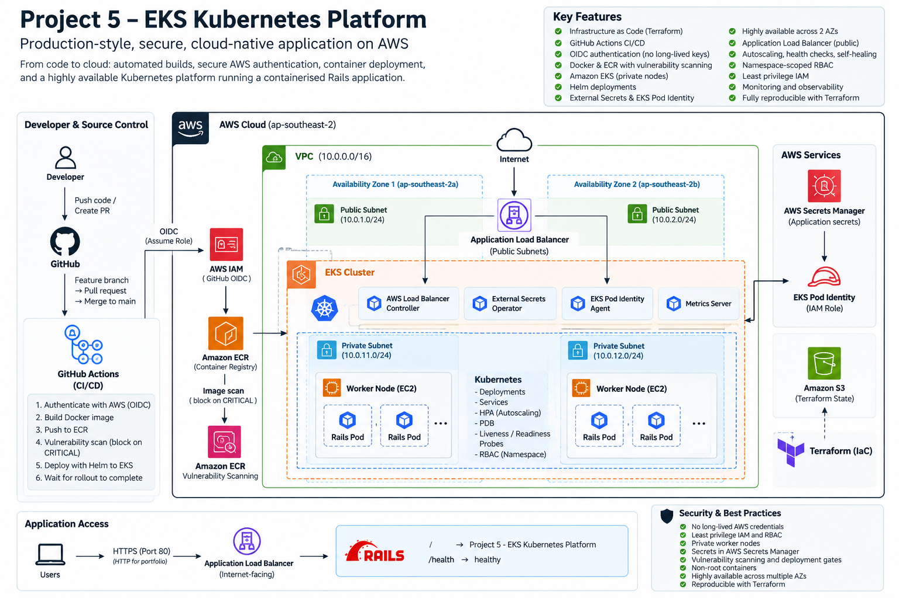

# Production-Style Kubernetes Platform on AWS EKS

A production-style Kubernetes platform built on AWS EKS using Terraform, Docker, Helm, GitHub Actions, AWS IAM, ECR, External Secrets, and EKS Pod Identity.

The project demonstrates the complete lifecycle of a containerised application: infrastructure provisioning, secure AWS authentication, container build and vulnerability scanning, Kubernetes deployment, secrets management, autoscaling, health checks, ingress, observability, failure recovery, and infrastructure rebuilds.

## Architecture



```text
Developer
    |
    v
Feature Branch
    |
    v
GitHub Pull Request
    |
    v
Merge to Main
    |
    v
GitHub Actions
    |
    +---- OIDC ----> AWS IAM
    |
    +---- Docker Build
    |
    +---- ECR Push
    |
    +---- Vulnerability Scan Gate
    |
    v
Amazon EKS
    |
    v
Helm
    |
    v
Kubernetes Deployment
    |
    +---- Rails Pods
    |       |
    |       +---- Liveness Probe
    |       +---- Readiness Probe
    |       +---- Resource Requests / Limits
    |
    +---- Horizontal Pod Autoscaler
    |
    +---- PodDisruptionBudget
    |
    v
Kubernetes Service
    |
    v
AWS Application Load Balancer
    |
    v
Application
```

AWS Secrets Manager supplies application secrets through External Secrets Operator and EKS Pod Identity without storing production secrets in GitHub or Kubernetes manifests.

## Technology Stack

- **AWS:** EKS, ECR, IAM, VPC, EC2, ALB, NAT Gateway, Secrets Manager, S3
- **Infrastructure as Code:** Terraform
- **Containers:** Docker
- **Kubernetes:** EKS, Deployments, Services, HPA, PDB, RBAC, probes
- **Package Management:** Helm
- **CI/CD:** GitHub Actions
- **Authentication:** GitHub OIDC and EKS Pod Identity
- **Secrets:** AWS Secrets Manager and External Secrets Operator
- **Application:** Ruby on Rails
- **Observability:** Kubernetes Metrics Server, logs, events and resource metrics

## AWS Infrastructure

Terraform provisions the AWS platform, including:

- VPC with public and private subnets across two Availability Zones
- Internet Gateway and NAT Gateway
- Amazon EKS control plane
- Managed EKS worker node group in private subnets
- Amazon ECR repository
- AWS Load Balancer Controller
- Kubernetes Metrics Server
- External Secrets Operator
- EKS Pod Identity Agent
- IAM roles and policies
- GitHub Actions OIDC integration
- Kubernetes namespace and deployment RBAC
- Remote Terraform state stored in Amazon S3

The EKS worker nodes run only in private subnets. Public subnets are used for the internet-facing Application Load Balancer.

## CI/CD Pipeline

A push to `main` triggers the GitHub Actions deployment pipeline.

The workflow:

1. Authenticates to AWS using GitHub OIDC.
2. Builds the Rails Docker image for `linux/amd64`.
3. Pushes the image to Amazon ECR using the Git commit SHA as the image tag.
4. Waits for the ECR vulnerability scan to complete.
5. Blocks deployment if CRITICAL vulnerabilities are detected.
6. Connects to Amazon EKS.
7. Deploys the application using Helm.
8. Waits for the Kubernetes rollout to complete.

No long-lived AWS access keys are stored in GitHub.

## Security

Security was treated as a platform requirement rather than an afterthought.

Key controls include:

- GitHub OIDC instead of long-lived AWS credentials
- Least-privilege IAM permissions for GitHub Actions
- EKS access entries combined with namespace-scoped Kubernetes RBAC
- Dedicated EKS Pod Identity roles for AWS-integrated workloads
- VPC CNI permissions separated from the EC2 worker-node IAM role
- AWS Secrets Manager for production application secrets
- External Secrets Operator for Kubernetes secret synchronisation
- Private EKS worker nodes
- Immutable ECR image tags
- ECR vulnerability scanning on image push
- CI/CD deployment gate for CRITICAL vulnerabilities
- Non-root application container
- Minimal runtime container packages
- Kubernetes ServiceAccounts with unnecessary token mounting disabled
- Kubernetes liveness and readiness probes
- Resource requests and limits
- PodDisruptionBudget

## Secrets Management

The Rails `SECRET_KEY_BASE` is stored persistently in AWS Secrets Manager.

External Secrets Operator retrieves the value using EKS Pod Identity and creates the required Kubernetes Secret inside the application namespace.

The secret value is never committed to Git and is not managed as plaintext Terraform configuration.

The AWS secret intentionally survives normal Terraform platform destruction so the platform can be rebuilt without regenerating application secrets.

## Reliability and Scaling

The application is configured with:

- Two application replicas
- Kubernetes self-healing
- Rolling deployments
- Liveness probes
- Readiness probes
- Horizontal Pod Autoscaling
- PodDisruptionBudget
- CPU and memory resource configuration
- Kubernetes Metrics Server

Failure testing confirmed that healthy replicas remained available during a deliberately broken deployment and that Kubernetes automatically replaced deleted application pods.

## Infrastructure State

Terraform state is stored remotely in an encrypted Amazon S3 bucket with versioning enabled.

Native Terraform S3 state locking is enabled to protect against concurrent state modification.

The state backend is provisioned separately from the main EKS platform so it survives platform destruction.

## Troubleshooting and Failure Testing

A major focus of this project was troubleshooting real infrastructure and deployment failures rather than only demonstrating a successful deployment.

### VPC CNI Bootstrap Dependency

After migrating the Amazon VPC CNI from permissions inherited through the EC2 worker-node role to a dedicated EKS Pod Identity role, the change worked correctly on the existing cluster.

A later clean infrastructure rebuild exposed a bootstrap dependency.

New worker nodes registered with EKS but remained `NotReady` because the VPC CNI could not initialise. Investigation showed:

```text
NetworkPluginNotReady
cni plugin not initialized
```

The `aws-node` DaemonSet then exposed the underlying AWS permissions failure:

```text
MissingIAMPermissions
failed to call ec2:DescribeNetworkInterfaces
```

The root cause was Terraform dependency ordering: the EKS Pod Identity Agent and VPC CNI Pod Identity association were being created only after the managed node group became healthy. However, the node group required a functioning VPC CNI to become healthy.

The Terraform dependency graph was changed so that the Pod Identity infrastructure and CNI association are established before worker-node creation.

A clean rebuild then succeeded with:

- both EKS nodes `Ready`
- `aws-node` containers `2/2 Running`
- EKS Pod Identity Agent running on each node
- VPC CNI operating through its dedicated IAM role
- no requirement to restore CNI permissions to the general EC2 node role

This demonstrated an important difference between validating an in-place security migration and validating a platform from a clean bootstrap.

### Container Vulnerability Gate

The deployment pipeline was deliberately configured to fail closed when ECR reported CRITICAL vulnerabilities.

A deployment was blocked after the scanner identified CRITICAL vulnerabilities associated with an unnecessary `curl` package in the runtime image.

`curl` was removed from the production image, the image was rebuilt, and the pipeline subsequently passed the vulnerability gate.

### ECR Scan Availability Race

The initial vulnerability gate could query ECR before the image scan was available.

The workflow was updated with retry logic so deployment waits for scan availability rather than incorrectly continuing or failing due to the timing race.

### Helm Deployment Ordering

A clean deployment exposed a race between External Secrets Operator and the AWS Load Balancer Controller webhook.

Terraform dependencies were updated so the required controller was available before dependent Helm resources were installed.

### Failed Kubernetes Rollout

A deliberately invalid container image was deployed to test failure behaviour.

The new pod entered `ImagePullBackOff`, while the two existing healthy replicas continued serving traffic.

The failed rollout was detected and rolled back to the known-good revision. Public health checks remained available during the failure.

### Pod Self-Healing

A healthy application pod was manually deleted.

Kubernetes automatically created a replacement pod and restored the desired replica count while the application remained available.

## Production Trade-Offs

This project is intentionally designed as a portfolio environment rather than a full enterprise production platform.

To control cost and complexity:

- One NAT Gateway is used rather than one per Availability Zone.
- The EKS API exposes a public endpoint so GitHub-hosted Actions runners can reach the cluster. Authentication and authorisation are still enforced through IAM, EKS access entries, and Kubernetes RBAC.
- The Application Load Balancer currently serves HTTP rather than HTTPS.
- The worker node group uses small general-purpose EC2 instances.
- The platform runs across two Availability Zones but is not designed for multi-region disaster recovery.

In a production environment, I would evaluate NAT Gateway redundancy, private CI/CD runners, restricted/private EKS API access, ACM-managed TLS, stronger monitoring and alerting, backup requirements, and workload-specific availability objectives.

## Clean Rebuild Validation

The entire chargeable platform was destroyed and rebuilt from Terraform to validate that the repository could reproduce the environment rather than relying on manually-created infrastructure.

The rebuild uncovered and resolved the VPC CNI bootstrap issue described above.

After the fix, the platform successfully rebuilt and the GitHub Actions pipeline deployed the application back onto the new EKS cluster.

Final validation confirmed:

- EKS nodes healthy
- VPC CNI healthy
- EKS Pod Identity functioning
- AWS Load Balancer Controller healthy
- External Secrets synchronising successfully
- Metrics Server healthy
- application Deployment `2/2`
- application pods healthy with zero restarts
- internet-facing ALB provisioned
- `/health` returning `healthy`
- application endpoint publicly reachable

## Repository Structure

```text
.
├── .github/
│   └── workflows/       # CI/CD pipeline
├── app/                 # Rails application and Docker image
├── bootstrap/           # Terraform state backend bootstrap
├── helm/
│   └── project5-app/    # Application Helm chart
├── kubernetes/          # Kubernetes manifests and RBAC
└── terraform/           # AWS EKS platform infrastructure
```

## What I Learned

This project strengthened my practical understanding of:

- Kubernetes architecture and troubleshooting
- Amazon EKS
- Terraform dependency management and remote state
- Docker image design
- Helm deployments
- AWS IAM and least-privilege access
- GitHub OIDC
- EKS Pod Identity
- Kubernetes RBAC
- AWS networking
- Kubernetes health checks and self-healing
- Horizontal Pod Autoscaling
- AWS Secrets Manager and External Secrets Operator
- container vulnerability management
- CI/CD failure handling
- infrastructure troubleshooting

The most valuable lesson was that a platform is not proven simply because it works once. Destroying and rebuilding the environment exposed dependency and bootstrap behaviour that was invisible in an already-running cluster.

## Project Status

**Complete**

The platform has been built, security-hardened, failure-tested, destroyed, rebuilt from Terraform, and redeployed successfully through CI/CD.
